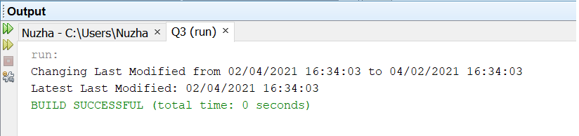

# Turning-Back-the-Clock
This project changes the last modified date of any file in Java.

It is a simple program written in Java, which accepts three command line arguments
1. A string of the form MM/DD/YYYY representing the new date
2. A string of the form HH:MM:SS representing 24-hour time in Eastern Standard Time
3. A string representing the name of a file in the current directory

In case any argument is missing or not in the above format, the code displays the exception message.  
On executing the program, it displays the current last modified and updated last modified date of the file. The output is shown below.

## How to run
You can run this code by executing the ``ChangeLastModified.java`` file in any Java IDE.
